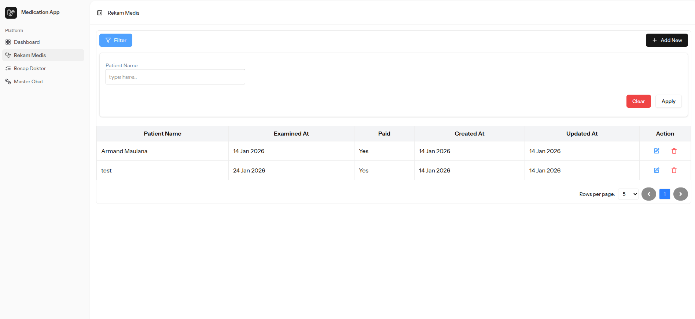
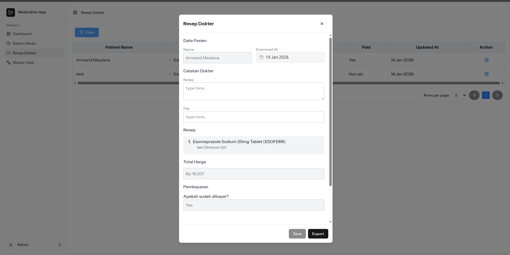

# Rekam Medis (medication app)

Aplikasi **Rekam Medis** untuk manajemen data pasien, resep dokter, dan pembayaran. Dibangun menggunakan **Laravel** di backend dan **Blade/PDF** untuk cetak resep atau struk pembayaran.

## Stack

- Laravel 12
- MySQL 8.0.4
- VueJs

---

## Fitur Utama

- CRUD **Data Pasien** hanya untuk **Dokter / Admin** (Rekam Medis)
- Manajemen pembayaram **Resep Dokter** untuk **Apoteker / Admin** (Resep Dokter)
- Export **PDF Resep Dokter** dan struk pembayaran (menu Resep Dokter) **Resep Dokter** untuk **Apoteker / Admin**
- Middleware role-based access (`Admin`, `Doctor`, `Pharmacist`)

---

## Instalasi

### 1. Clone repository:

```
git clone https://github.com/doniarifin/medication-app.git
cd medication-app
```

### 2. Install Depedencies

```
composer install
npm install
```

### 3. Copy .env

```
cp .env.example .env
```

config sesuai database lokal

```
DB_CONNECTION=mysql
DB_HOST=127.0.0.1
DB_PORT=3306
DB_DATABASE=medication
DB_USERNAME=root
DB_PASSWORD=
```

### 4. Generate key lalu jalankan migrate

```
php artisan key:generate
php artisan migrate
```

jika ingin ulang jalnakan

```
php artisan migrate:fresh
```

### 5. Jalankan DB seed (untuk import data medicines dan prices)

sudah saya sertakan user sesuai role admin, dokter, dan apoteker dapat di lihat di `./database/seeders/DatabaseSeeder.php`

untuk run db seed

```
php artisan db:seed
```

jika sudah run db seed maka bisa login dengan:

admin:

`email: admin@example.com`,
`pass: admin123`

dokter:

`email: dokter@example.com`,
`pass: dokter123`

apoteker:

`email: apoteker@example.com`,
`pass: apoteker`

**Note:**

jika ingin membuat akun sendiri maka set `role` harus sesuai enum yg ada di path `./app/Enums/UserRole.php`

list enums role:

```
case Admin = 'admin';
case Doctor = 'doctor';
case Pharmacist = 'pharmacist';
case User = 'user';
```

jika ingin role **Dokter** maka column **role** di tabel **users** harus `doctor`

### 6. Jalankan app

untuk menjalankan aplikasi, bisa menggunakan salah satu dari dua cara:

- pakai composer

```
composer run dev
```

- php artisan serve

```
php artisan serve
npm run dev
```

Jika menggunakan `php artisan serve`, frontend (JS/Vue/Tailwind) tidak akan otomatis berjalan, harus menjalankan `npm run dev` agar tampilan dan interaksi frontend berfungsi dengan baik.

##

# Demo

## Rekam Medis

Berikut penjelasan tiap bagian Menu:



1. Sidebar Menu

- Dashboard: Halaman utama untuk ringkasan aplikasi.
- Rekam Medis: Halaman untuk melihat dan mengelola data pasien.
- Resep Dokter: Halaman untuk mengelola resep yang diberikan dokter.
- Master Obat: Halaman untuk melihat daftar obat.

2. Button

- Button Filter: Untuk membuka field inputan.
- Button Edit (icon pensil) dan Hapus (icon sampah) data.
  **Edit button** hanya untuk data yg belum dibayar
- Add New digunakan untuk menambahkan data pasien baru.
- Apply untuk search
- Clear untuk reset pencarian

## Resep Dokter



click icon pencil untuk memunculkan Menu export dan update pembayaran

- button export akan disabled jika belum melakukan pembayaran
- button save akan disabled jika sudah melakukan pembayaran
